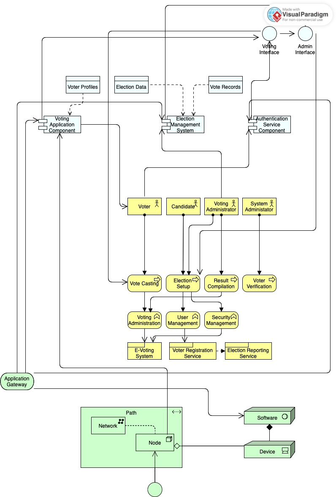

# Software Design tasks by Oleksandr Mykhailenko & Anton Kolesnikov

---

## Requirements & Use Case

Link to SRS: https://docs.google.com/document/d/1gYbN96vcs3UZMZKSuCpEqW2v-FJG7cg30J7fT9gVnac
Use Case diagram for the E-Voting system: 

### Use case description:

### Voter use cases

#### Secure Authentication
Brief Description: Secure Authentication is a use case where a voter can authenticate
using a government-provided identity verification service. Multifactor authentication supports
the security of the authentication mechanism by imposing a second layer authentication to
authorize actions, such as an OTP (one-time password).

#### Ballot Casting Interface
Brief Description: Ballot Casting Interface is a use case where a voter can see the candidates
who take part in the elections, vote for them, and verify that their vote is included on
the ledger.

#### Real-time Voting Status
Brief Description: Real-time Voting Status is a use case where a voter can see their vote
in a particular election, how is it being validated, is it finalized, is it rejected, etc.

####  Voter History
Brief Description: Voter History is a use case where a voter can view their past voting
results.

### Election Official use cases
**NOTE**: We will use the abbreviation EO to mean Election Official.

#### Election Setup
Brief Description: Election Setup is a use case where an EO can schedule voting periods,
setup candidate profiles for the elections, and initialize (start) elections.

#### Voter Roll Management
Brief Description: Voter Roll Management is a use case where an EO can manage voters
in an ongoing election. This includes blacklisting, viewing voter lists, and other functionality.

#### Real-time Monitoring
Brief Description: Real-time Monitoring is a use case where an EO can see metrics for the
ongoing elections, including the turnout, total votes gathered, and other business-defined
valuable metrics. Real-time Monitoring includes generating reports from the gathered metrics
and monitoring the voting process as a whole.

#### Election Result Compilation
Brief Description: Election Result Compilation is a use case where an EO can view the
calculated voting results, the winning candidate, announce election outcomes to all
voters, and verify voting results to check for fraud, platform manipulation, and implement
other election control mechanisms.

### System Administrators use cases
**NOTE**: We will use the abbreviation SA to mean System Administrator.

#### System Maintenance
Brief Description: System Maintenance is a use case where an SA can perform runtime upgrades
of the blockchain, configure logging/tracing/metrics reporting, update the software in case
of identification of bugs, define backup policies, and perform health checks using the management
dashboard.

#### Security Protocols
Brief Description: Security Protocols is a use case where an SA can configure security protocols,
such as configuring time limit & skew for time-based OTPs (TOTPs), configuring rate limiting
to prevent DoS attacks, and impose other security restrictions on the system.

#### User Management
Brief Description: User Management is a use case where an SA can manage user profiles, defining
RBAC for the Voter & EO roles, as well as permissions for the roles themselves.

#### Audit Trails
Brief Description: Audit Trails is a use case where an SA can view detailed system logs and
traces, collect valuable system metrics from the gathered data, and prevent security threats
based on the collected information.

BPMN Diagram: TODO

## Logical & Data View

### IDEF0 Diagram

Describes the process of voting with appropriate Inputs, Controls, Outputs, and Mechanisms.

### Process descriptions

##### Planned Elections
Brief Description: This stage is where the framework and schedule for upcoming elections
are established, guided by legal and procedural protocols, and managed by election
officials. It culminates in the designation of a fixed period during which the actual
voting will take place.

##### Schedule Voting Period
Brief Description: In this phase, the system prepares for the voting period by securing
and verifying the list of government-approved voters, ensuring that only eligible
individuals participate. This involves system administrators setting up and validating
the timeframe for the election, with secure authentication measures in place for voter
access.

##### Voting Process
Brief Description: The core of the E-Voting system is the voting process itself,
where voters log in to the system, view candidates, cast their votes, and then, after
the voting period concludes, review the results and their own voting history. The system
administers the tallying of votes, calculates candidate ratings, and generates a detailed
analysis of the voting outcomes.

##### Monitoring & Audit
Brief Description: To maintain the integrity of the e-voting process, system
administrators and election officials actively monitor the system's activity, backed by
stringent security protocols. This ensures transparency and accuracy through regular
audits, reinforcing trust in the electronic democracy system.

### DFD Diagram

Describes the data flows between the Elections Blockchain & the Government DB, the entities involved
and the processes.

#### Government System DB Utilization
##### Voter Setup
Brief Description: This process taps into the Government System database to
authenticate and enroll voters, ensuring that the electoral database reflects accurate
and officially verified voter information.

##### Voter Authentication
Brief Description: Voter authentication is a critical step that uses the Government
System database to verify the identities of individuals before granting access to the
voting platform, upholding the election's security and integrity.

##### Voter Identity Provision
Brief Description: In this preparatory phase, authenticated voters receive a public
address generated from their government-verified identities, linking them to the
centralized DLT while maintaining their anonymity for the voting process.

#### Centralized Election Blockchain (DLT) Utilization
##### Voting Process
Brief Description: The voting process records each transaction on the centralized
Election Blockchain (DLT), ensuring that every vote is securely logged and that the
integrity of the vote is maintained within the controlled ledger environment.

##### Candidate Setup
Brief Description: Election officials utilize the centralized Election Blockchain (DLT)
to securely record candidate information, establishing a transparent and secure database
of candidates that is resistant to unauthorized alterations.

In this data flow diagram, the distinction between the Government System database and
the centralized Election Blockchain (DLT) highlights the dual approach to security and
integrity within the E-Voting system. The Government System database provides a reliable
source for voter verification, while the centralized Election Blockchain (DLT) ensures
that the voting process and candidate information are securely and accurately recorded,
benefiting from the distributed ledger's attributes while being managed in a centralized
manner for added control and oversight.

### UML Class diagram

Describes user classes & type definitions.

#### Role Class
Brief Description: The Role class is a critical component of the E-Voting system's
architecture, defining the specific functions and permissions assigned to various users
within the system. With attributes like name and a list of permissions, this class serves
as a foundation for role-based access control, ensuring that users can only perform
actions that are within their allowed capabilities, such as managing roles, scheduling
voting, or managing candidate information.

#### User Class
Brief DescriptionL: The abstract User class forms the core identity of all system
participants, encapsulating essential attributes like name, address, publicKey, and
roleName. This class enforces a secure and consistent identification mechanism, which
is the backbone for authentication and authorization processes in the system.

#### ExternalUser Class
Brief Description: Derived from the User class, the ExternalUser is also abstract and
introduces an identity token, which implies a secondary level of authentication,
for users interfacing with the system from external points: Voters and Election Officials.
System Administrators do not need an identity token since they are not a direct participant
in the election process.

#### SystemAdministrator Class
Brief Description: The SystemAdministrator class is central to the management and
maintenance of the E-Voting system. It does not inherit from the ExternalUser since
system administrators are not participants in the election process and do not require
an identity token for system interactions. Their methods focus on the high-level
oversight of the system, including granting roles, setting permissions, and managing
the system infrastructure. This class ensures that administrators have the necessary
tools to manage the system effectively, maintain its integrity, and enforce the security
protocols.

#### Voter Class
Brief Description: The Voter class encapsulates the functionalities available to voters,
such as casting votes (vote) and viewing the votes they have cast (viewCurrentVote).

#### ElectionOfficial Class
Brief Description: This class reflects the responsibilities of election officials, with 
methods for adding candidates (addCandidate), scheduling the voting (scheduleVoting),
and retrieving election data.

#### VoteResult Class
Brief Description: Representing the results of voting transactions, the VoteResult
class contains attributes to detail the election (electionId), the candidate
(candidateId), and whether the results are finalized (finalized). This class is crucial, 
providing a clear and immutable record of each vote's outcome.

## Process View

### UML Activity diagram

Describes sample user voting flow.

#### Brief Description
#### Initiation of Voting:
The process is triggered when a user, whose credentials have been verified, starts the 
voting procedure.

#### Candidate Selection:
The system displays the candidates, enabling the user to review their options before
casting a vote.

#### Decision to Vote:
At this juncture, the system determines whether the user has already voted. If the 
user has not cast a vote, the process advances to the voting action.

#### Vote Submission:
The user selects a candidate and submits their vote. This action is formalized as a
blockchain transaction, recording the vote securely on the blockchain.

#### Post-Vote Activities:
Following the vote submission, the system concurrently:

**Secures the vote on the blockchain**, guaranteeing the permanence and integrity of
the vote.

**Gathers analytics data**, which could serve various purposes such as assessing voter
engagement or system performance.

**Dispatches in-app notifications** to provide immediate feedback to the user about
their voting action.

#### Confirmation and Review:
The system logs the voting results and conveys the user's vote and its current status
back to the user, ensuring the user is informed of the successful submission and the
ongoing state of the election.

#### Conclusion:
The process reaches its endpoint once all activities have been executed, marking
the completion of the user's voting experience.

### UML Sequence diagram

Describes the whole election setup, voting, and result & audit compilation flow.

#### Election Preparation

* **The Government** provides the election schedule to the Election Official.
* **The Election Official** then coordinates with the System Admin to set up the voting period.
* **The System Admin** configures the system by setting up logging, reporting services,
and audit rules.

#### Voting Process

* **The Voter**, upon passing authentication, requests the candidate list, selects a
candidate, and submits their vote.
* **The System** monitors the voting process, while the Blockchain component records the 
vote.
* **An Audit** may be conducted simultaneously, with the Reports component generating 
relevant summaries.

#### Post-Voting

* After the voting period concludes, **the System** calculates the voting results.
* **The Voter** can request past and current vote information.
* **The Government** requests election reports and audit summaries to review the
election's integrity.

#### Conclusion
The sequence ends with the production of an election report and an audit summary
that is provided to the **Election Official** and **Government**, ensuring transparency
and accountability in the election process.

### UML State chart

Describes the state of the system with the full flow of elections process.

#### Uninitialized Elections
The state chart begins with the elections in an uninitialized state,
indicating that no configurations or scheduling have been set up.

#### Setting Up
Transitioning from uninitialized, the system enters a setup phase where the election
timeline is established and essential services are configured to facilitate the election.

#### Elections Period Defined on the E-Voting Blockchain
The system achieves a state where the election dates are known and have been defined within
the E-Voting blockchain, ensuring a transparent and immutable schedule.

#### Monitoring & Reporting is Up
Concurrently, the system ensures that the infrastructure for monitoring the election and
reporting data is active and ready to function throughout the election process.

#### System Is Ready For Upcoming Elections
This state is the culmination of having both the election period and monitoring systems 
set up, indicating full preparedness for the election.

#### E-Voting Ready for Elections
In this state, the E-Voting system is now ready to accept voters, and the elections can
officially start.

#### Elections Started
The election process has begun, marking the start of the voting period where voters can 
submit their ballots.

#### Voting In Progress
With the elections underway, this state reflects the active participation of voters and
the ongoing collection of votes.

#### Elections Finished
The final state is achieved when the election process concludes, determined either
by the collection of a sufficient number of votes or by the end of the voting period.

### UML Component diagram

Describes provided & required interfaces of the blockchain components with an
inner component.

#### Blockchain Component
The blockchain component houses three ports, with two of them providing interfaces,
and one of them requiring an interface. The component requires a Genesis interface,
which is an interface that can read an "initial state" JSON file and transform it into the
starting state of the blockchain storage. It is used to later provide initial permissions.

The two provided interfaces are the Voting interface and the Permission Management interface.
They allow users of the component to start/end elections, vote, view current voting status,
as well as manage permissions of the users in the E-Voting System.

#### State Orchestrator
The State Orchestrator component requires the Genesis outer interface, and transforms it
into a meaningful initial state with permissions defined for a limited set of users, providing
the Initial Permissions interface to the Permissions Module component

#### Permissions Module
The Permissions Module component requires the Initial Permissions interface from the State
Orchestrator, and allows users (specifically, System Administrators) to manage users' permissions.
It also provides a View Permissions interface to the Voting Module, which users RBAC to
decide on the validity of its received transactions.

#### Voting Module
The Voting Module component requires the View Permissions interface to decide on the validity 
of its received transactions. By checking permissions, the Voting Module is able to provide
and interface of Voting and Elections Management.

## Business, Application, Technology View

Describes the system from the business level, the application level, and the technology
level.

