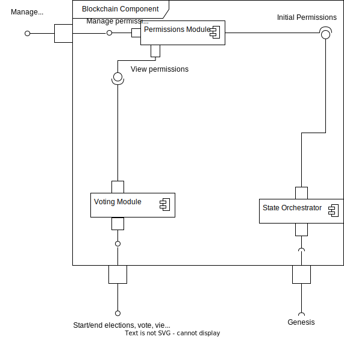

# Software Design tasks by Oleksandr Mykhailenko & Anton Kolesnikov

---

## Sprint 1: SRS, Use Case, BPMN

Link to SRS: https://docs.google.com/document/d/1gYbN96vcs3UZMZKSuCpEqW2v-FJG7cg30J7fT9gVnac
Use Case diagram for the E-Voting system: 
BPMN Diagram: TODO

## Sprint 2: IDEF0, DFD

### IDEF0 Diagram

Describes the process of voting with appropriate Inputs, Controls, Outputs, and Mechanisms.

### DFD Diagram

Describes the data flows between the Elections Blockchain & the Government DB, the entities involved
and the processes.

## Sprint 3: UML

### UML Class diagram

Describes user classes & type definitions.

### UML Activity diagram

Describes sample user voting flow.

### UML Sequence diagram

Describes the whole election setup, voting, and result & audit compilation flow.

### UML State chart

Describes the state of the system with the full flow of elections process.

### UML Component diagram

Describes provided & required interfaces of the blockchain components with an
inner component.

