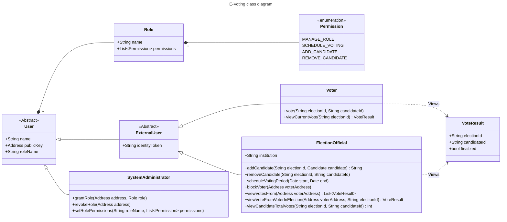

```mermaid
---
title: E-Voting class diagram
---
classDiagram
direction LR
class Role {
+String name
+List~Permission~ permissions
}

    class Permission {
        <<enumeration>>
        MANAGE_ROLE
        SCHEDULE_VOTING
        ADD_CANDIDATE
        REMOVE_CANDIDATE
    }

    class User {
        <<Abstract>>
        +String name
        +Address publicKey
        +String roleName
    }
    class ExternalUser {
        <<Abstract>>
        +String identityToken
    }

    class Voter {
        +vote(String electionId, String candidateId)
        +viewCurrentVote(String electionId) VoteResult
    }

    class ElectionOfficial {
        +String institution
        +addCandidate(String electionId, Candidate candidate) String
        +removeCandidate(String electionId, String candidateId)
        +scheduleVotingPeriod(Date start, Date end)
        +blockVoter(Address voterAddress)
        +viewVotesFrom(Address voterAddress) List~VoteResult~
        +viewVoteFromVoterInElection(Address voterAddress, String electionId) VoteResult
        +viewCandidateTotalVotes(String electionId, String candidateId) Int
    }

    class VoteResult {
        +String electionId
        +String candidateId
        +bool finalized
    }
    
    class SystemAdministrator {
        +grantRole(Address address, Role role)
        +revokeRole(Address address)
        +setRolePermissions(String roleName, List~Permission~ permissions)
    }

    Role "*" *-- Permission 
    User "1" *-- Role
    User <|-- ExternalUser
    User <|-- SystemAdministrator
    ExternalUser <|-- Voter
    ExternalUser <|-- ElectionOfficial
    Voter ..> VoteResult : Views
    ElectionOfficial ..> VoteResult : Views

```
