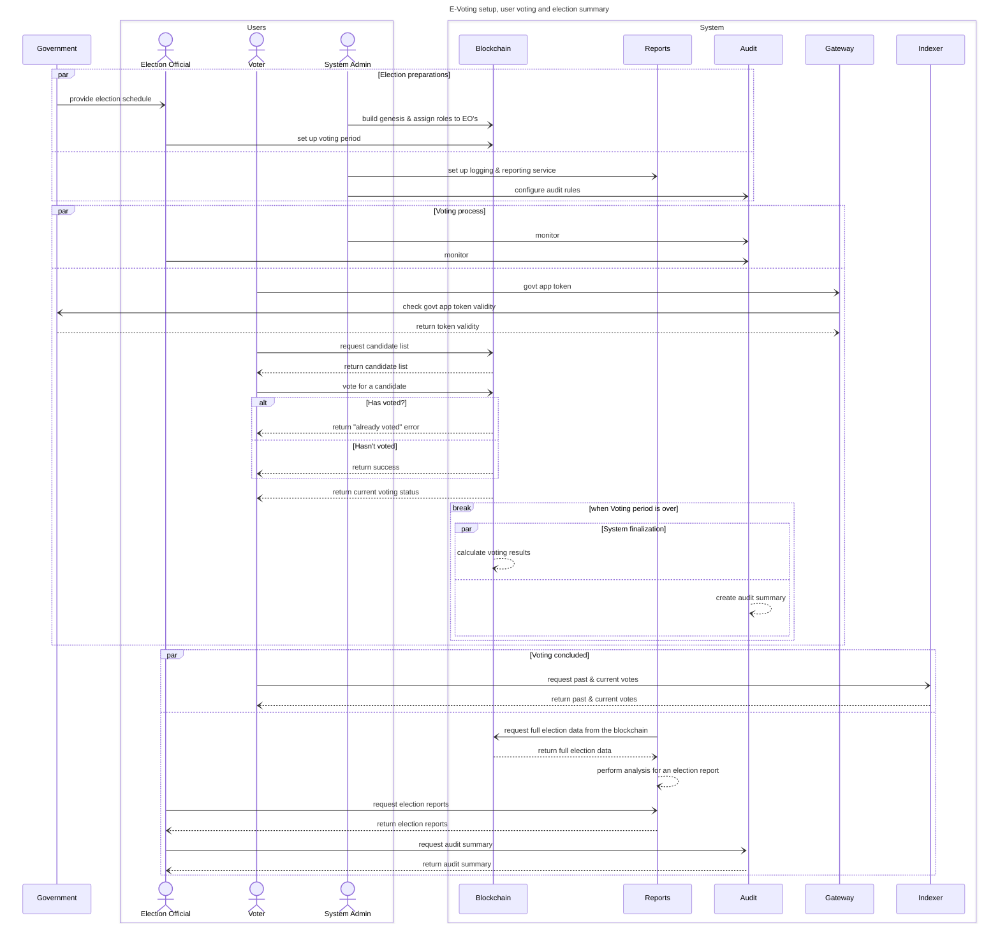

```mermaid
sequenceDiagram
    Title E-Voting setup, user voting and election summary
    participant GOV as Government
    box Users
        actor EO as Election Official
        actor V as Voter
        actor ADM as System Admin
    end
    box System
        participant BC as Blockchain
        participant REP as Reports
        participant AUD as Audit
        participant GW as Gateway
        participant IDX as Indexer
    end

    par Election preparations
            GOV-)EO: provide election schedule
            ADM-)BC: build genesis & assign roles to EO's
            EO-)BC: set up voting period
        and
            ADM-)REP: set up logging & reporting service
            ADM-)AUD: configure audit rules
    end

    par Voting process
            ADM-)AUD: monitor
            EO-)AUD: monitor
            activate AUD
        and
            V-)GW: govt app token
            GW-)GOV: check govt app token validity
            GOV--)GW: return token validity
            V-)BC: request candidate list
            BC--)V: return candidate list
            V-)BC: vote for a candidate
            alt Has voted?
                BC--)V: return "already voted" error
            else Hasn't voted
                BC--)V: return success
            end
            BC--)V: return current voting status

        break when Voting period is over
            par System finalization
                    BC--)BC: calculate voting results
                and
                    AUD--)AUD: create audit summary
            end
        end
    end

    par Voting concluded
            V-)IDX: request past & current votes
            IDX--)V: return past & current votes
        and
            REP-)BC: request full election data from the blockchain
            BC--)REP: return full election data
            REP--)REP: perform analysis for an election report
            EO-)REP: request election reports
            REP--)EO: return election reports
            EO-)AUD: request audit summary
            AUD--)EO: return audit summary
    end
```