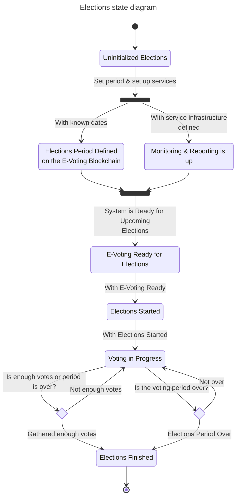

```mermaid
---
title: Elections state diagram
---
stateDiagram-v2
    UNINIT: Uninitialized Elections
    DATEKNOWN: Elections Period Defined<br>on the E-Voting Blockchain
    MONITORING: Monitoring & Reporting is up
    SYSTEMREADY: E-Voting Ready for Elections
    STARTED: Elections Started
    VOTING: Voting in Progress
    FIN: Elections Finished
    
    [*] --> UNINIT
    state fork_state <<fork>>
    UNINIT --> fork_state: Set period & set up services
    fork_state --> DATEKNOWN: With known dates
    fork_state --> MONITORING: With service infrastructure<br>defined

    state join_state <<join>>
      DATEKNOWN --> join_state
      MONITORING --> join_state

    join_state --> SYSTEMREADY: System is Ready for Upcoming<br>Elections
    SYSTEMREADY --> STARTED: With E-Voting Ready
    STARTED --> VOTING: With Elections Started
    
    state enough_votes <<choice>>
        VOTING --> enough_votes: Is enough votes or period is over?
        enough_votes --> VOTING: Not enough votes
        enough_votes --> FIN: Gathered enough votes
    state is_over <<choice>>
        VOTING --> is_over: Is the voting period over?
        is_over --> VOTING: Not over
        is_over --> FIN: Elections Period Over
    FIN --> [*]

```